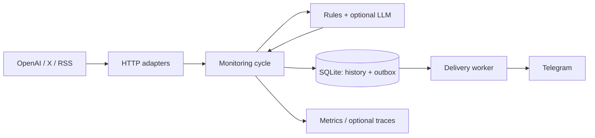

# Codex Reset Watcher

[](https://github.com/golosoman/codex-reset-watcher/actions/workflows/ci.yml)

Небольшой Go-сервис, который следит за анонсами сброса лимитов Codex / ChatGPT Work и присылает новые значимые события в Telegram. Если новостей нет, бот молчит. PostgreSQL, брокер и LLM для запуска не нужны.

## Что приходит в Telegram

| Событие | Что означает |
|---|---|
| `global_reset_confirmed` | Авторитетный источник сообщил о сбросе лимитов |
| `banked_reset_confirmed` | Сообщили о выдаче дополнительного сохранённого reset |
| `reset_announced` | Объявлен будущий сброс |
| `reset_imminent` | Сброс ожидается в ближайшее время |
| `reset_signal` | Ранний сигнал, но не подтверждение |
| `reset_completed` | Источник сообщил о завершении распространения reset |

Каждое сообщение содержит объяснение, цитату-доказательство и ссылку на источник. Community-источник не может самостоятельно подтвердить сброс. Это мониторинг **публичных сообщений**, а не проверка оставшихся лимитов конкретного аккаунта.

## Источники

- OpenAI Status: структурированный API инцидентов и обновлений.
- OpenAI Help Center: смысловые блоки статьи, а не хеш всей страницы.
- Официальная документация: независимый Markdown-адаптер.
- Thibault Sottiaux (`@thsottiaux`): официальный X API, включая ответы автора. Нужен собственный Bearer token с доступом к чтению timeline.
- Дополнительные RSS / Atom / JSON feeds: только уровень доверия `community`.

**Без `X_BEARER_TOKEN` источник Tibo недоступен.** Остальные адаптеры продолжают работать. Help Center может возвращать HTTP 403: сервис показывает проблему, не обходит защиту сайта и не считает отсутствие доступа отсутствием новостей. Status API не является полноценной заменой публикациям Tibo.

## Архитектура



`domain` не знает о сети и БД; `monitor` определяет интерфейсы на своих границах. Адаптеры реализуют их; зависимости собираются только в `cmd/watcher`. Тесты находятся рядом с пакетами, общие исходные данные в `testdata`. Решения и ограничения описаны в [ADR](docs/ADR-001.md).

## Быстрый запуск

Требуется Docker Compose. Создай `.env` по `.env.example`, укажи `TELEGRAM_BOT_TOKEN` и числовой `TELEGRAM_CHAT_ID`. Пользователь должен ранее открыть бота и отправить `/start`.

```bash
install -d -m 700 data
sudo chown 65532:65532 data
chmod 600 .env
docker compose build
docker compose run --rm watcher validate-telegram
docker compose up -d
curl -fsS http://127.0.0.1:8501/readyz
```

При первом успешном чтении **каждого источника** создаётся baseline без рассылки старых новостей. Следующие проверки ищут новые события. Интервал по умолчанию час плюс случайная задержка до пяти минут; очередь доставки проверяется каждые 30 секунд.

Данные лежат в `./data`, переживают пересоздание контейнера. Не запускай два экземпляра на одной SQLite. HTTP доступен только на loopback; `/readyz` показывает состояние каждого источника, `/metrics` отдаёт Prometheus.

## Настройка

| Переменная | По умолчанию / назначение |
|---|---|
| `TELEGRAM_BOT_TOKEN`, `TELEGRAM_CHAT_ID` | Обязательные секрет и получатель |
| `ADMIN_CHAT_ID` | Пусто: отключены сообщения об ошибках источников |
| `ADMIN_FAILURE_THRESHOLD` | `3`; не чаще одного предупреждения в сутки на источник |
| `X_BEARER_TOKEN`, `X_USERNAME` | Ключ X; автор `thsottiaux` |
| `CHECK_INTERVAL`, `CHECK_JITTER` | `1h`, `5m` |
| `SOURCE_TIMEOUT`, `SOURCE_CONCURRENCY` | `30s`, `3` |
| `INITIAL_LOOKBACK`, `MAX_EVENT_AGE` | `48h`, `72h` |
| `NOTIFY_SIGNALS` | `true`; отправлять неподтверждённые ранние сигналы |
| `DATABASE_PATH` | `/data/watcher.db` |
| `HTTP_LISTEN_ADDR` | `:8080` внутри контейнера |
| `LOG_LEVEL` | `info`; JSON-логи |
| `OPENAI_HELP_URLS` | Необязательный список официальных HTTPS-страниц через запятую |
| `EXTRA_FEEDS_JSON` | `[]`; дополнительные community feeds |
| `LLM_ENABLED` | `false` |
| `LLM_API_KEY`, `LLM_MODEL` | Обязательны только при включённом LLM |
| `OTEL_EXPORTER_OTLP_ENDPOINT` | Пусто: экспорт трассировок выключен |

Для ключей Telegram, X и LLM можно использовать переменные `*_FILE` с путями к смонтированным файлам секретов. Одновременно задавать значение и файл запрещено. `.env` и БД игнорируются Git.

Пример дополнительного feed:

```dotenv
EXTRA_FEEDS_JSON=[{"name":"community-tracker","url":"https://example.com/feed.xml","kind":"community","format":"rss"}]
```

RSS и Atom требуют даты и стабильного идентификатора. JSON поддерживает JSON Feed (`items`, `id`, `url`, `content_text` / `content_html`, `date_published`) и структурированные `items` с `text`, `published_at`.

## Классификация и доставка

Детерминированные правила идут первыми. Опциональный LLM вызывается только для неоднозначного текста: строгая JSON Schema, проверка дословного evidence, кеш по модели, версии промпта и содержимому. Ответ источника считается недоверенными данными. При включении LLM текст таких публикаций передаётся в OpenAI API; API-стоимость отдельна от подписки ChatGPT.

Источник, нормализованный хеш, внешний ID, близость времени и доказательства используются для корреляции. Растущий статус одного reset может вызвать новое уведомление: «анонс» и «завершено» не одинаковые сообщения. Глобальный и banked reset никогда не объединяются.

История события и outbox фиксируются одной транзакцией. Отправка отмечается успешной только после ответа Telegram с `message_id`. Обычные временные ошибки повторяются с backoff. **Telegram не даёт ключ идемпотентности:** при неизвестном результате отправки или аварии в состоянии `sending` запись становится `uncertain` и автоматически не повторяется. Это защищает от повторных сообщений, но требует операторского разбора возможного пропуска.

## Разработка

Go **1.27.1**, golangci-lint **2.14.0**, govulncheck **1.8.0**. Зависимости закреплены в `go.mod` / `go.sum`; SQLite работает без CGO. Race detector требует доступный C compiler.

```bash
go install golang.org/x/vuln/cmd/govulncheck@v1.8.0
make check
make test
```

CI проверяет форматирование, vet, race, lint, уязвимости, статическую сборку и Docker build. Тесты используют `httptest`, временные SQLite и локальные fixtures: настоящие Telegram-сообщения и API-ключи не нужны.

## Эксплуатация

- Контейнер: non-root, read-only rootfs, 128 MiB RAM, 0.25 CPU, ограничение процессов и ротация логов.
- SQLite: WAL, `synchronous=FULL`, ограничение основной БД примерно 128 MiB; WAL и backup требуют дополнительного места.
- История проверок хранится 7 дней, однозначно нерелевантные материалы 30 дней. Значимые события, их дубли и неоднозначные доказательства, доставки и результаты LLM сохраняются для разбора и дедупликации.
- Метрики: проверки, длительность, запросы/ошибки источников, найденные события, доставки, доступность источника и время последнего успеха. Идентификаторы публикаций, текста и пользователя не являются labels.
- Включение Grafana / collector не требуется. Публичный доступ к диагностическим endpoints не предусмотрен.

Восстановление, backup и безопасная повторная доставка: [операторская инструкция](docs/OPERATIONS.md).
