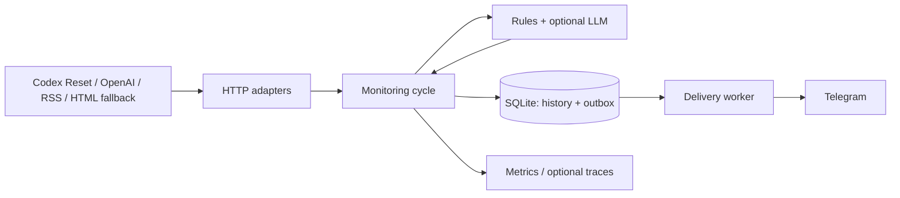

# Codex Reset Watcher

[](https://github.com/golosoman/codex-reset-watcher/actions/workflows/ci.yml)

Небольшой Go-сервис, который следит за анонсами сброса лимитов Codex / ChatGPT Work и присылает новые значимые события в Telegram. Если новостей нет, бот молчит. PostgreSQL, брокер и LLM для запуска не нужны.

**Основной мониторинг бесплатный:** не нужны X API, Twitter Developer Account, поисковые API или платные RSS-сервисы. Единственные обязательные секреты - Telegram token и получатель.

## Что приходит в Telegram

| Событие | Что означает |
|---|---|
| `global_reset_confirmed` | Авторитетный источник сообщил о сбросе лимитов |
| `reset_confirmed` | Доверенный источник подтвердил reset, но тип ещё не уточнён |
| `banked_reset_confirmed` | Сообщили о выдаче дополнительного сохранённого reset |
| `reset_announced` | Объявлен будущий сброс |
| `reset_imminent` | Сброс ожидается в ближайшее время |
| `reset_signal` | Ранний сигнал, но не подтверждение |
| `reset_completed` | Источник сообщил о завершении распространения reset |
| `reset_propagating` | Пользователи или tracker наблюдают reset; завершение ещё не подтверждено |

Каждое сообщение содержит объяснение, цитату-доказательство и ссылку на источник. Community-источник не может самостоятельно подтвердить сброс. Это мониторинг **публичных сообщений**, а не проверка оставшихся лимитов конкретного аккаунта.

## Источники

| Источник | Назначение | Доверие |
|---|---|---|
| [Codex Reset feed](https://codex-reset.com/api/feed) | Публикации и ответы Tibo | `first_party_derived` только при совпадении профиля, оригинального URL и ID |
| [Codex Reset timeline](https://codex-reset.com/api/timeline) | Контекст reset и наблюдения tracker | `aggregator`, даже при `confidence=high` |
| OpenAI Status | Инциденты и reset evidence | `official`; outage сам по себе не reset |
| OpenAI Help / публичные docs | Официальные изменения | `official` |
| [Twiscan](https://twiscan.com/en/x/thsottiaux) | HTML fallback публикаций Tibo | `first_party_derived` для проверенной структуры публикации; без обхода защиты |
| OpenAI Community RSS | Обсуждения и наблюдения | `community`; ник не доказывает принадлежность к OpenAI |
| Reddit RSS | Наблюдения Plus / Pro / Business | `community`; доступ зависит от сети, возможен 403 |
| RSSHub | Необязательный резервный RSS | `first_party_derived` только с оригинальным permalink Tibo; иначе `community` |

**Публикации Tibo обычно получаются через сторонние публичные агрегаторы, а не напрямую из X.** Сохраняем canonical X URL, ID, автора и транспорт; `first_party_derived` не равен `official`. Сводка timeline остаётся интерпретацией агрегатора, даже если ссылается на Tibo. Все копии одного origin коррелируются, confidence не растёт от числа перепечаток.

Feed и timeline проверяются независимо. Свежесть определяется по `stale`, `fetched_at` / `updated_at`, а не по HTTP 200 или возрасту последнего поста: молчание автора не означает отказ источника. При stale/ошибке feed включается Twiscan; при его отказе - RSSHub, если настроен. Источник с отключённым флагом имеет состояние `disabled`, резерв в ожидании - `standby`. Пустая сломанная HTML-разметка сразу считается `degraded`.

Help Center может возвращать HTTP 403: сервис показывает проблему, не обходит защиту и не считает её отсутствием новостей. При отказе всех Tibo-источников Status/docs продолжают работать, но полнота ранних анонсов не гарантируется.

## Архитектура



`domain` не знает о сети и БД; `monitor` определяет интерфейсы на своих границах. Адаптеры реализуют их; зависимости собираются только в `cmd/watcher`. Тесты находятся рядом с пакетами, общие исходные данные в `testdata`. Решения и ограничения описаны в [ADR](docs/ADR-001.md).

## Быстрый запуск

Требуется Docker Compose. Создай `.env` по `.env.example`, укажи `TELEGRAM_BOT_TOKEN` и числовой `TELEGRAM_CHAT_ID`. Пользователь должен ранее открыть бота и отправить `/start`.

```bash
install -d -m 700 data
sudo chown 65532:65532 data
chmod 600 .env
docker compose build
docker compose run --rm watcher validate-telegram
docker compose up -d
curl -fsS http://127.0.0.1:8501/readyz
```

При первом успешном чтении **каждого источника** создаётся baseline без рассылки старой истории. Исключение: публикация младше `SOURCE_INITIAL_NOTIFY_WINDOW` (по умолчанию 20 минут) может уведомить уже в baseline; `0s` полностью отключает исключение. Материалы без исходной даты в первый раз не рассылаются. Проверка выполняется сразу после запуска, затем каждые 5 минут плюс jitter до 30 секунд; перекрывающихся циклов нет. Очередь доставки проверяется каждые 30 секунд.

Ожидаемая задержка: до одного интервала + jitter + время HTTP/доставки **после появления данных у источника**. Задержка самого агрегатора добавляется; real-time и персональный сброс квоты не обещаются. Старый пост, внезапно добавленный агрегатором, не рассылается старше `MAX_EVENT_AGE` (по умолчанию 2 часа).

Данные лежат в `./data`, переживают пересоздание контейнера. Не запускай два экземпляра на одной SQLite. HTTP доступен только на loopback; `/readyz` показывает состояние каждого источника, `/status` добавляет последние события, `/history` даёт последние 10 переходов, `/events/{id}` показывает доказательства группы и историю доставки без Telegram credentials. Это HTTP endpoints, не команды Telegram: бот только отправляет сообщения и не вмешивается в существующего notifier.

## Настройка

| Переменная | По умолчанию / назначение |
|---|---|
| `TELEGRAM_BOT_TOKEN`, `TELEGRAM_CHAT_ID` | Обязательные секрет и получатель |
| `ADMIN_CHAT_ID` | Пусто: отключены сообщения об ошибках источников |
| `ADMIN_FAILURE_THRESHOLD` | `6`; не чаще одного предупреждения в сутки на источник |
| `CHECK_INTERVAL`, `CHECK_JITTER` | `5m`, `30s` |
| `SOURCE_TIMEOUT`, `SOURCE_CONCURRENCY` | `30s`, `3` |
| `INITIAL_LOOKBACK`, `MAX_EVENT_AGE` | `48h`, `2h` |
| `SOURCE_INITIAL_NOTIFY_WINDOW`, `SOURCE_STALE_AFTER` | `20m`, `2h` |
| `CODEX_RESET_FEED_ENABLED`, `CODEX_RESET_TIMELINE_ENABLED` | `true`, `true`; URL задаются соответствующими `*_URL` |
| `TWISCAN_ENABLED`, `TWISCAN_URL` | `true`; HTML fallback |
| `COMMUNITY_RSS_ENABLED`, `COMMUNITY_RSS_URL` | `true`; OpenAI Community |
| `REDDIT_ENABLED`, `REDDIT_URL` | `true`; публичный Reddit RSS |
| `RSSHUB_ENABLED`, `RSSHUB_TIBO_URL` | `false`, пусто; собственный разрешённый RSSHub |
| `NOTIFY_SIGNALS` | `true`; отправлять неподтверждённые ранние сигналы |
| `NOTIFY_PROPAGATING` | `true`; отправлять начало наблюдаемого распространения |
| `DATABASE_PATH` | `/data/watcher.db` |
| `HTTP_LISTEN_ADDR` | `:8080` внутри контейнера |
| `LOG_LEVEL` | `info`; JSON-логи |
| `OPENAI_HELP_URLS` | Необязательный список официальных HTTPS-страниц через запятую |
| `EXTRA_FEEDS_JSON` | `[]`; дополнительные community feeds |
| `LLM_ENABLED` | `false` |
| `LLM_API_KEY`, `LLM_MODEL` | Обязательны только при включённом LLM |
| `OTEL_EXPORTER_OTLP_ENDPOINT` | Пусто: экспорт трассировок выключен |

Для ключей Telegram и LLM можно использовать переменные `*_FILE` с путями к смонтированным файлам секретов. Одновременно задавать значение и файл запрещено. `.env` и БД игнорируются Git. Полный пример флагов и URL - `.env.example`.

Пример дополнительного feed:

```dotenv
EXTRA_FEEDS_JSON=[{"name":"community-tracker","url":"https://example.com/feed.xml","kind":"community","format":"rss"}]
```

RSS и Atom требуют даты и стабильного идентификатора. JSON поддерживает JSON Feed (`items`, `id`, `url`, `content_text` / `content_html`, `date_published`) и структурированные `items` с `text`, `published_at`.

## Классификация и доставка

Детерминированные правила идут первыми. Опциональный LLM вызывается только для неоднозначного текста: строгая JSON Schema, проверка дословного evidence, кеш по модели, версии промпта и содержимому. Ответ источника считается недоверенными данными. При включении LLM текст таких публикаций передаётся в OpenAI API; API-стоимость отдельна от подписки ChatGPT.

Источник, нормализованный хеш, внешний ID, близость времени и доказательства используются для корреляции. Растущий статус одного reset может вызвать новое уведомление: «анонс» и «завершено» не одинаковые сообщения. Глобальный и banked reset никогда не объединяются.

История события и outbox фиксируются одной транзакцией. Отправка отмечается успешной только после ответа Telegram с `message_id`. Обычные временные ошибки повторяются с backoff. **Telegram не даёт ключ идемпотентности:** при неизвестном результате отправки или аварии в состоянии `sending` запись становится `uncertain` и автоматически не повторяется. Это защищает от повторных сообщений, но требует операторского разбора возможного пропуска.

## Разработка

Go **1.27.1**, golangci-lint **2.14.0**, govulncheck **1.8.0**. Зависимости закреплены в `go.mod` / `go.sum`; SQLite работает без CGO. Race detector требует доступный C compiler.

```bash
go install golang.org/x/vuln/cmd/govulncheck@v1.8.0
make check
make test
```

CI проверяет форматирование, vet, race, lint, уязвимости, статическую сборку и Docker build. Тесты используют `httptest`, временные SQLite и локальные fixtures: настоящие Telegram-сообщения и API-ключи не нужны.

## Эксплуатация

- Контейнер: non-root, read-only rootfs, 128 MiB RAM, 0.25 CPU, ограничение процессов и ротация логов.
- SQLite: WAL, `synchronous=FULL`, ограничение основной БД примерно 128 MiB; WAL и backup требуют дополнительного места.
- История проверок хранится 7 дней, однозначно нерелевантные материалы 30 дней. Значимые события, их дубли и неоднозначные доказательства, доставки и результаты LLM сохраняются для разбора и дедупликации.
- Метрики: проверки, длительность, запросы/ошибки источников, найденные события, доставки, доступность источника и время последнего успеха. Идентификаторы публикаций, текста и пользователя не являются labels.
- Включение Grafana / collector не требуется. Публичный доступ к диагностическим endpoints не предусмотрен.

Восстановление, backup и безопасная повторная доставка: [операторская инструкция](docs/OPERATIONS.md).
