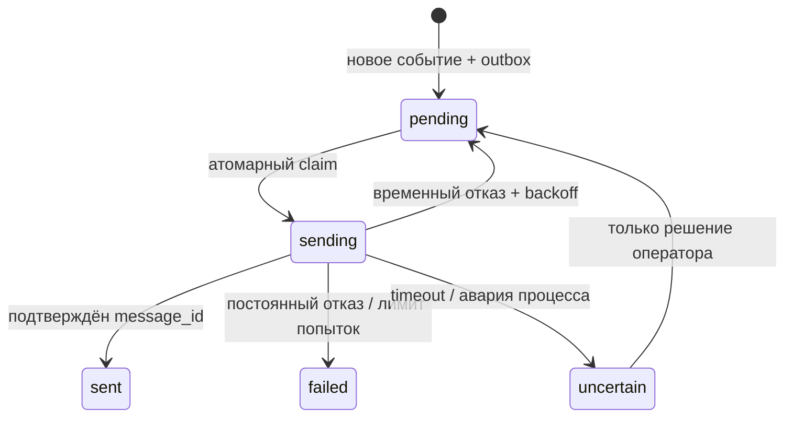
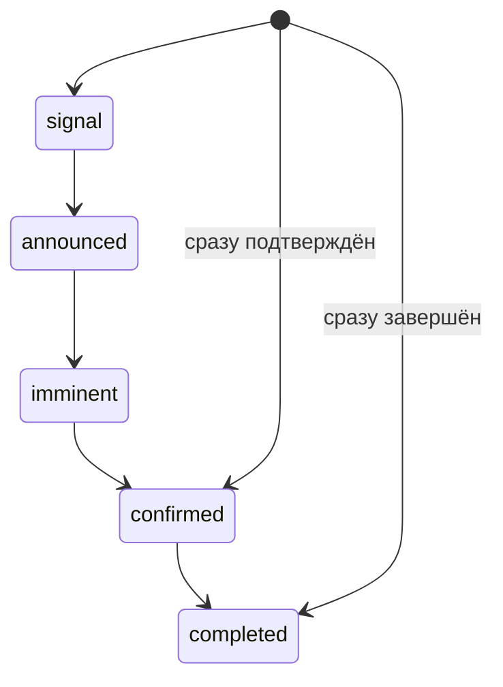

# ADR-001: небольшой watcher с устойчивой историей

Статус: принято. Дата: 2026-10-04.

## Контекст

Нужен один постоянно работающий экземпляр на небольшом VPS. Достоверность важнее количества найденных упоминаний: обычное еженедельное обновление квоты и сброс пароля не должны выглядеть как глобальный reset.

## Решение

Используем pragmatic ports-and-adapters. В `monitor` находятся сценарии проверки и доставки, там же интерфейсы источника, классификатора, хранилища и уведомителя. `domain` содержит только данные и правила доверия. `cmd/watcher` собирает реальные зависимости. Несколько источников представлены файлами одного пакета `source`: пока отдельные каталоги лишь увеличили бы количество переходов без независимых подсистем.

Базовый HTTP-клиент и стандартная библиотека покрывают внешние API. `x/net/html` нужен для структурированного разбора HTML. `modernc.org/sqlite` позволяет собрать статический бинарник без CGO. OpenTelemetry и Prometheus обеспечивают стандартную интеграцию без обязательного collector. Go модули закреплены; дублирующие ORM, очереди, SDK Telegram и DI-фреймворки не вводятся.

## Состояние

SQLite хранит состояния источников, уникальные версии материалов `(source, external_id, text_hash)`, reset-группы, события, outbox, проверки и LLM-кеш. Миграции встроены в бинарник и применяются транзакционно. Единственный экземпляр и одно соединение делают запись последовательной.

Успешный cycle источника сохраняет данные, события, outbox и watermark одной транзакцией. Ошибка API, JSON, даты или полной пагинации не продвигает watermark. Перекрытие чтения 10 минут защищает от задержанных записей. Каждый источник имеет независимый первый baseline без уведомлений: запуск или добавление источника не рассылает историю.

Telegram не поддерживает клиентский ключ идемпотентности. Поэтому exactly-once на границе сети не обещается. Перезапуск превращает незавершённый `sending` в `uncertain`, а не слепо повторяет доставку. Даже явный HTTP 5xx теоретически может скрывать обработанную операцию; повторы таких ошибок дают стандартную at-least-once границу. Перед ручным повтором оператор проверяет историю чата.

## Доверие и корреляция

Подтверждение разрешено официальному или настроенному first-party адаптеру X. Community нельзя повысить до official через env. Правила отделяют контекст продукта от случайного слова reset. Optional LLM получает только неоднозначный материал, строгую схему и инструкцию считать текст данными. Evidence проверяется как дословная часть публикации; результаты кешируются. Недоступность модели не блокирует детерминированные правила.

Корреляция использует одинаковую публикацию, прямую ссылку на X, хеш, сходство текста в близком окне и однозначный follow-up того же автора. Одинаковый текст следующего дня не считается автоматически вчерашним событием. Banked и global разделены. Порог сходства эвристический, поэтому идеальную семантическую дедупликацию неизвестных формулировок не обещаем. При нескольких возможных группах не угадываем по одной близости времени.

Новая стадия reset может отправляться отдельно от предыдущей: анонс, imminent, подтверждение, завершение. Это полезное изменение факта, а не повтор одинакового события.

Допустимы пропуски стадий; уведомление возникает только при увеличении ранга группы. `confirmed -> confirmed` и возврат на меньший ранг ничего не отправляют. При `NOTIFY_SIGNALS=false` стадия signal сохраняется, но не рассылается.

## Источники и ограничения

X API - основной путь к публикациям Tibo; ключ и тариф доступа предоставляет владелец. Без ключа источник unavailable, остальные продолжают работать. Структурированные community feeds можно добавить отдельно, но они не заменяют доверие first-party. Scraping X не используется.

Help Center иногда отвечает 403: фиксируем degraded и не обходим защиту. Независимые Status и официальные Markdown-страницы продолжают опрашиваться. Официальная документация обычно меняется реже анонсов, и не всякий reset появляется в Status. Без работающего Tibo feed полнота мониторинга ограничена.

## Ресурсы и безопасность

Ограничиваем ответы HTTP, таймауты, пагинацию, concurrency и очередь обработки за один проход. БД ограничена по числу страниц; незначимые старые материалы и технические проверки очищаются. При исчерпании хранилища транзакция не теряет старые события и не продвигает состояние успешного чтения. Историю значимых событий не удаляем автоматически.

Один контейнер без публичных портов, non-root, read-only rootfs, минимальные права. Секреты только env / mounted files; в логах нет токенов, текстов исключений с Telegram URL или LLM-запросов. Метрики имеют только ограниченные labels источника и статуса. Приватный GitHub-репозиторий не считается допустимым местом для секретов.

## Что не вводим

Не проверяем личные лимиты через неофициальные endpoints, не выполняем вход в аккаунт ChatGPT, не используем пользовательские session cookies. Не строим распределённую очередь ради одного VPS. Не обещаем внешние backup или автоматический deploy до их отдельной настройки. Не отправляем тестовый «reset confirmed» в настоящий Telegram.
